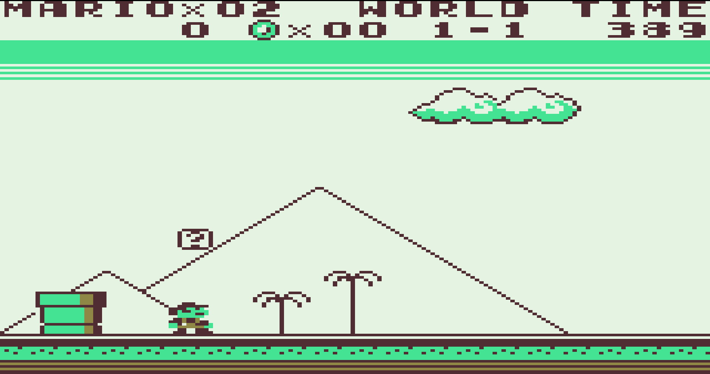
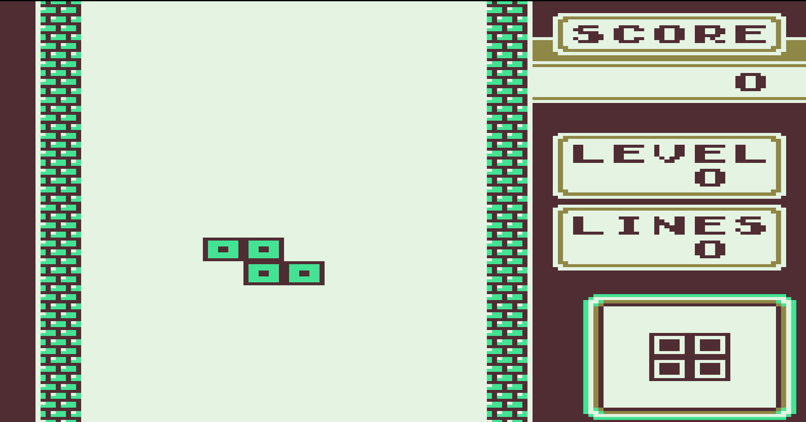
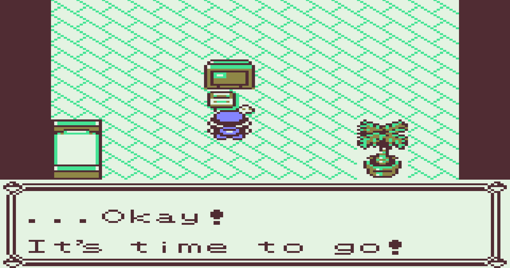
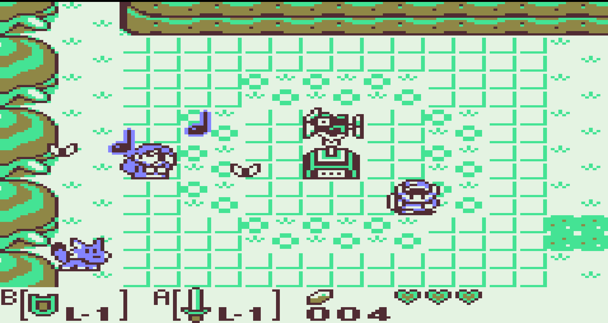
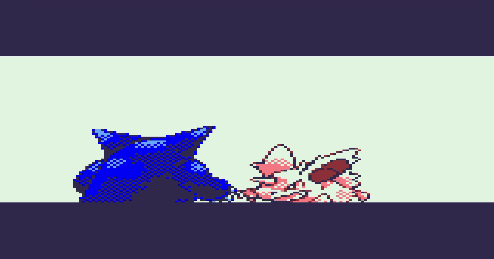
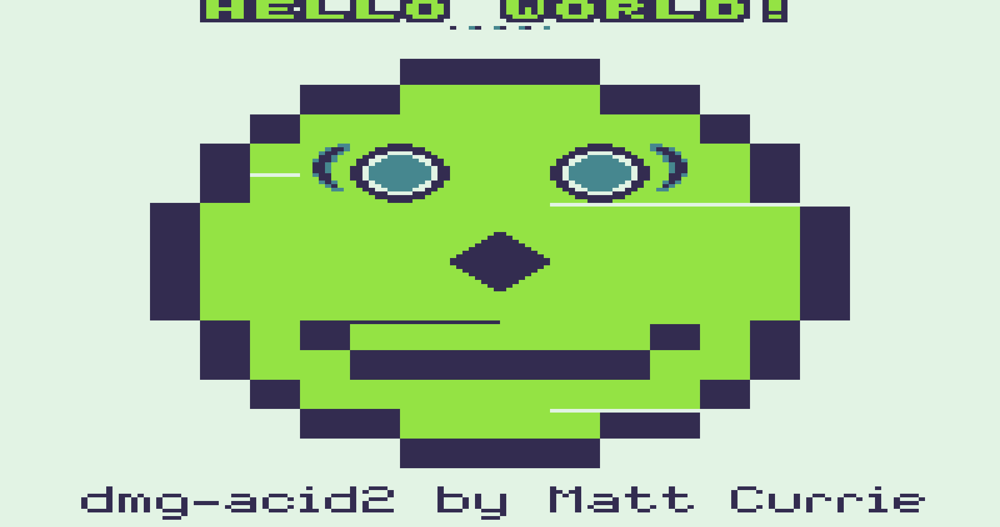

# Gameboy Emulator
This is my messy implementation of a gameboy emulator using C++. I've been working on this on and off (whenever I had
time, but sometimes I was too busy to work on it). I generally tried to refactor after finishing a subset of emulator though.

## Screenshots
### Pictures
<p align="center">
  
  
</p>
<p align="center">
  
  
</p>

Note I took these pictures when I had a small bug in rendering (Red and Blue channels were swapped).

I used this colour scheme: https://lospec.com/palette-list/kirokaze-gameboy for the background. This is also the colour scheme for my emulator for both sprites + background.

For sprites, I used the colour scheme used here: https://binji.github.io/posts/pokegb/

### Gifs
<p align="center">
  
  
</p>

I used this colour scheme for Link's Awakening: https://lospec.com/palette-list/kirokaze-gameboy.

For Pokemon, I used this: https://binji.github.io/posts/pokegb/

## Installation
These instructions are targeted towards Ubuntu 18.04. I don't know the installation process for other operating systems.

First, clone the repo wherever you want.

Install CMakeLists:
```
sudo apt-get install cmake
```

Install SDL2:
```
sudo apt-get install libsdl2-*
```

You can install GTest if you want to run that one test I wrote but probably not worth it. I've commented out the code
that part that uses it (since I ended up not really using it)

Compile and build (assuming you are at the repo directory):
```
mkdir build
cd build
cmake ..
make
```

The generate file will be called `gb-emulator`, and will be located in the `build` folder.

I think that's about it, but I haven't verified the installation part (since I already have the dependencies). I also
have a Dockerfile that can do it for you, but I haven't looked into how to get graphics to display in Docker yet and how
to mount a volume to it (so that files can be moved back and forth).

## Using the Emulator
To run with a ROM for the first time:
```
./gb-emulator <path-to-gb-file>
```

To run with a ROM with a sav file:
```
./gb-emulator <path-to-gb-file> <path-to-sav-file>
```

You need to make sure you use the correct ROM and associated sav file. To see how to save files, see the controllers.
Note: the emulator doesn't support other emulators sav files. The format I use is just a straight dump of a bunch of
different variables in binary format. This lets you start right back where you ended.

## Controls
Keyboard Input | Gameboy Input
---    | ---
Up | Up
Down | Down
Left | Left
Right | Right
Z | A
X | B
Space | Select
Enter | Start
Window Exit | Quit **with** overwrite save file
Escape | Quit **without** overwrite save file

## Configuring the Emulator
For configurations, for now, direct modification of the source code + recompilation is required. To change the colour schemes, `src/PPU/PPU.cpp` has 3 unordered maps for changing colours in an anonymous namespace at the top of the file. These can be modified from the emulator directly to whatever colour. I used 3 to provide further flexibility (it's why the sprites and background have different colours for example).

For modifying the save file name, this can be done in the `src/CPU/CPU.cpp` in the `loadROM` function.

As a future TODO, I might expose these parameters in the future for modification during runtime.

## Games Tested
- Dr Mario
- Tetris
- Super Mario Land
  - Top sometimes flashes
- Legend of Zelda Link's Awakening
- Super Mario Land 2
- Pokemon Red
  - Has some graphics issues (e.g. random tiles flash on bootup)

I tested mostly just the beginning of these games few mins of these games so note that. I don't recommend using this emulator for playing games unless you're fine with potential bugs creeping up (at worst, losing your save data).

## Future TODOs
If I decide to pursue this again, I may do the following:
- Make CPU cycle accurate
- Switch to PPU fifo
- Refactoring of code to better integrate everything together
- Add audio support
- Expose colour palette + controllers, etc to allow for more customization
- Loading configs from file maybe
- Support renaming of save file, using multiple save files, not overwriting it, etc
- Better GUI (e.g. buttons to load game, etc)
- Add safety to the code (e.g. prevent not using gb files for rom). I have some safe practices but my code overall isn't
  really safe

## Notes on implementation
Originally, the plan was to write this in modern C++. That clearly did not pan out. The gameboy instruction set is quite
large so I ended up implementing it a pretty messy way. In hindsight, with better plan, there are lots of chunks that I
could have reused (e.g. some opcodes do basically the same thing but slightly differently). I did do some code reuse
(which is why my raw opcode count is much less than 512), in hindsight, I should have reused a lot more things.

Suggested CPU implementations:
- Hashmap that maps opcode -> a struct consisting of instruction. This struct would contain a field the "type of access" (e.g.
  use a register as an address vs read from memory vs just use a register directly), as well as a generic implementation
  for the instruction itself. I'm in too deep to do this though.

I also realized that I rely on the MMU for handling interrupts, timers and PPU registers. This isn't necessarily a bad thing, since they are located on specific memory addresses, but in hindsight, I think it would have been cleaner to have separated out these functionalities into where they should go (e.g. have an interrupt manager, timer manager and put the relevant PPU functions into the PPU). I may refactor later to do this.

My emulator is clock accurate on the opcode level but isn't clock accurate in terms of memory accesses or interrupts.
Doing it at the whole interrupt level might be something I explore if it's necessary (I have some of it implemented but it's
unused because I didn't really need it and need to add some more things (like varying the number of cycles, etc), but doing it at the memory access
/ actual subopcode level is a bit inconvenient since I didn't realize this was necessary. In hindsight, I should have
read the entire pandoc instead of just reading as I implemented.

Another thing I believe would have been cleaner is having a 'bus' where I connect the different components. For
components that need direct access to particular parts, I would make a shared ptr and connect it directly. Additionally,
I think that I might use completely public classes rather than classes with private and public members in the future. I
somewhat badly planned parts of this due to it.

I also copied over a lot of code in multiple files / components (e.g. getBit, setBit, etc). In the future, I think
having a utils or common file that would contain code that I see being used often is a good idea just to increase code
reuse.

As I will mention later, my PPU implementation is inaccurate (because it relies on end of scanline rendering). This was
simpler, and my implementation ended up being a combination of the tutorial by CodeSlinger and the PPU description by the Gameboy Emulator Development Guide. In the future, I might refactor the follow what the real gameboy actually does (e.g. Pixel FIFO) to increase accuracy of my emulator but I'm happy with the results despite the low accuracy.

For ROM banking, I implemented enough of MBC3 to play Pokemon and enough of MBC1 to play games. I felt this was
sufficient. In the future, I might add more features (e.g. battery, latch clock, etc), but for now it's fine without. To
save, I instead just dumped all the data into a `.sav` file and called it a day. This soln worked well (and provides the
convenience of saving even in games without saving).

## Note on Tests
Originally I had planned on unit testing every function I wrote via GTest. While this approach is fine, I realized that
it was simpler to just rely on tools that were specifically created for testing gameboys (e.g. test ROMs). Due to this,
the testing part of this project was mostly abandoned.

## Testing ROMs Acknowledgements
For CPU instructions, I used blargg's tests. This can be found at: https://gbdev.gg8.se/wiki/articles/Test_ROMs or https://github.com/retrio/gb-test-roms

I currently pass the CPU instruction test and the instruction timing test.

I also mostly pass dmg-acid2 (see: https://github.com/mattcurrie/dmg-acid2). However, there are a few graphical errors (namely the smile extends slightly too much, ther are 2 white bars that are approx 1 pixel in height and go from the left side of the face's edge to the eye and from the right side of the mouth to the face's edge). I also have some dots under `HELLO WORLD!`. I plan on debugging this later on but it doesn't seem to affect playing games much. Also, note if you use multiple colours, the output resembles CGB running in DMG mode rather than the DMG mode (this behavior is correct, but you will see a similar graphical glitch to the below screenshot).

<p align="center">
  
</p>


## Debugging Acknowledgements
To get started on debugging my opcodes, I used BGB (https://bgb.bircd.org/) as a dissassembler on blargg's tests. This is a high accuracy emulator (see: https://gbdev.gg8.se/wiki/articles/Test_ROMs). I mainly used this to compare the output of the disassembler with my program (by printing out the status of my registers). This helped me find minor bugs that really messed up everyhing such as accidental infinite loops due to mixing up the order of registers in some instructions. Once I got past the requirements for blargg's tests initialization, I shifted to using it exclusively because it was a more scalable testing method.

## References
- Pandocs: https://gbdev.io/pandocs/
  - Contains everything you need to know about the gameboy
- gbops: https://izik1.github.io/gbops/index.html
  - Accurate opcode table for the gameboy (made planning easier)
- Gameboy CPU Manual: http://marc.rawer.de/Gameboy/Docs/GBCPUman.pdf
  - Manual on the gameboy CPU
- Gameboy Complete Technical Reference: https://gekkio.fi/files/gb-docs/gbctr.pdf
  - In progress (as of Aug 21st 2021) technical reference that I used
- Stackoverflow for half carry: https://stackoverflow.com/questions/57958631/game-boy-half-carry-flag-and-16-bit-instructions-especially-opcode-0xe8
  - I had trouble understanding how the half carry flag worked so I read this to understand
- Cinoop: https://cturt.github.io/cinoop.html
  - Used it for reference to inspire implementation (specifically registers)
- Codeslinger: http://www.codeslinger.co.uk/pages/projects/gameboy/beginning.html
  - High level tutorial for writing a gameboy emulator that I used when I was stuck and wanted another perspective on
    details of things
  - I used the blog for knowing how to render at the end of a scanline (since this isn't accurate to how a gameboy
    actually renders). **Note**: the rendering algorithms themselves have a lot of inaccuracies.
- Random NES website: http://archive.nes.science/nesdev-forums/f20/t15944.xhtmlhttp://archive.nes.science/nesdev-forums/f20/t15944.xhtml
  - Contains an explanation of DAA + implementation of DAA instruction that I copied for my DAA instruction
- Eric's blog: https://ehaskins.com/2018-01-30%20Z80%20DAA/
  - Contains an explanation of both what BCD is & what DAA is (more detailed) + implementation of DAA instruction
- The Gameboy Emulator Development Guide: https://hacktixme.ga/GBEDG/
  - At the time of use, it's incomplete but contains a really good PPU reference that explains it with visuals, etc.
    This helped me understand what to do (as I found it pretty confusing). (Link to PPU reference:
    https://hacktixme.ga/GBEDG/ppu)
- POKEGB: a gameboy emulator that only plays Pokemon blue: https://binji.github.io/posts/pokegb/
  - This inspired me to do all my rendering at the end of a scanline, rather than doing pixel fifo. I found the pixel
    fifo algorithm to be relatively complicated (and given how busy I've been, I didn't have enough time to understand
    the algorithm details, although I have a high level understanding, so I may revisit it later)
  - I also consulted this to figure how much of MBC3 I needed to emulate Pokemon
- Reddit post asking about PPU reset: https://www.reddit.com/r/Gameboy/comments/a1c8h0/what_happens_when_a_gameboy_screen_is_disabled/
  - Helped fix a bug where games would freeze at tile screen if LCD was disabled
- A bunch of SDL2 resources such as: http://slouken.blogspot.com/2011/02/streaming-textures-with-sdl-13.html,
  https://stackoverflow.com/questions/20753726/rendering-pixels-from-array-of-rgb-values-in-sdl-1-2 and https://stackoverflow.com/questions/52031503/how-to-render-a-rectangle-sdl2-texture-from-a-buffer-of-hex-values
- Retrocomputing stack exchange question: https://retrocomputing.stackexchange.com/questions/11732/how-does-the-gameboys-memory-bank-switching-work
  - Provided an explanation for how MBC1 worked and clarified things that I was confused about
- Reddit post asking about coincidence issues: https://www.reddit.com/r/EmuDev/comments/kjrfl3/problems_with_the_coincidencelylyc_interrupt/
  - Helped fix one of my PPU flashing bugs + inspired me to separate window & background logic to make it easier to use
    the gameboy development guide
